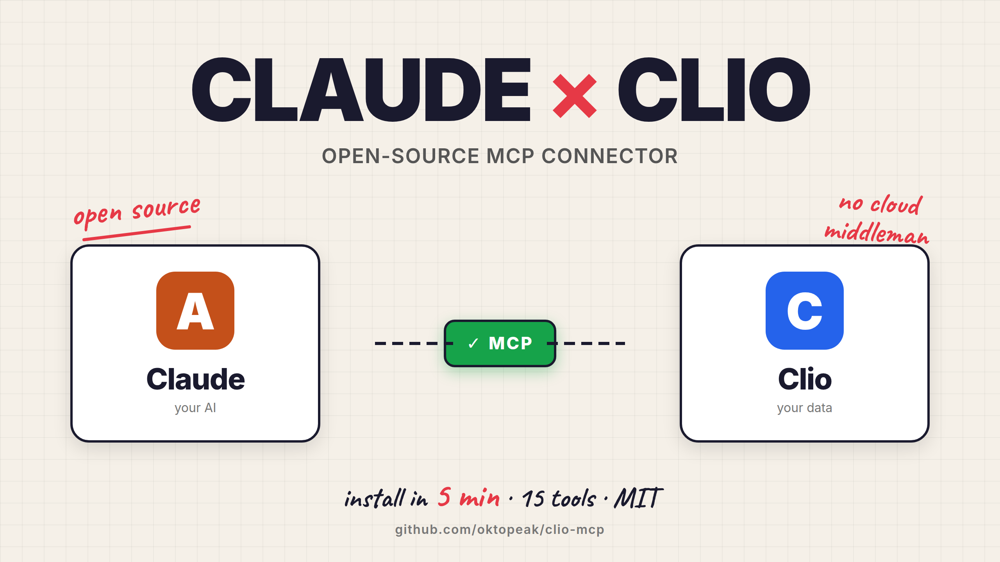

# Clio MCP Server: Connect Claude to Clio Practice Management

Open-source Model Context Protocol (MCP) connector that lets Claude read live data from [Clio](https://www.clio.com) — matters, contacts, documents, tasks, calendar, and billing — without copying client information into chat windows. Built for law firms that care about attorney-client privilege, ABA Opinion 512 compliance, and keeping AI workflows inside their existing practice management stack.

> **TL;DR** — 26 Clio tools exposed to Claude across stdio and HTTP/SSE transports. Audit-logged for ABA Opinion 512. OAuth tokens encrypted at rest with AES-256-GCM. Local-only — no relay server, no cloud middleman. MIT license, free forever.

**Who this is for:** Law firm IT, legal operations teams, tech-forward partners, and engineers at legal tech companies. If you can follow a five-step terminal install, you can use this.

> [!TIP]
> **Not a developer? You don't need to be.**
>
> The README below assumes someone comfortable editing a JSON config file. If that's not you or your team, we deploy this for law firms — scoped credentials, audit log wired in, one custom workflow, training. A simpler one-command installer is also planned for v0.2.
>
> → **[See Guided MCP Setup](https://oktopeak.com/services/mcp-guided-setup/?utm_source=github&utm_medium=readme&utm_campaign=clio-mcp&utm_content=top-tip-svc)** — or [book a 30-min call](https://calendly.com/office-oktopeak/30min?utm_source=github&utm_medium=readme&utm_campaign=clio-mcp&utm_content=top-tip-call)

**Jump to:** [Demo](#demo) · [Setup](#setup) · [Available tools](#available-tools) · [Security & compliance](#compliance--security) · [Need it deployed for you?](#need-more-than-the-connector)

---

## Demo

Watch Claude pull live data from Clio in under a minute — matters, contacts, tasks — without copying client information into chat.

<p align="center">
  <a href="https://youtu.be/RmB0iGyJ9cs">
    
  </a>
  <br><br>
  <a href="https://youtu.be/RmB0iGyJ9cs"><b>▶&nbsp;&nbsp;Watch the 60-second demo on YouTube</b></a>
</p>

---

**Setup tips + ABA Opinion 512 compliance updates for firms building with Claude + Clio.**

→ [Subscribe to Oktopeak Builder Notes](https://tally.so/r/q4kzk9?source=clio-readme) — short emails, easy unsubscribe.

---

## Compliance & Security

This section exists because law firms evaluating AI tools have asked the right questions. Here are direct answers.

### ABA Formal Opinion 512 — AI and competence

ABA Opinion 512 (2023) requires attorneys using AI tools to understand how those tools work, supervise their outputs, and maintain confidentiality of client information. This connector is designed with those obligations in mind:

- **Audit log.** Every tool call — every time Claude queries Clio on your behalf — is appended to a local log file at `~/.clio-mcp/audit.log`. Each entry records the timestamp, which tool was invoked, what arguments were passed, whether it succeeded, and the Clio user ID. The log is stored on your machine, not in any cloud service. It is append-only and never purged by the software, so your firm retains a complete record of AI-initiated data access.

- **No data retention by the connector.** The connector does not store matter data, client names, or any Clio content. It fetches from the API and passes results to Claude. The only thing persisted locally is your authentication token, and that is encrypted (see below).

- **Scope limited to tasks, notes, and document uploads.** The connector can create tasks and notes on matters, and upload documents to matters. It cannot create, edit, or delete matters, contacts, calendar entries, or billing records. This is a deliberate v1 design choice — write access is limited to the operations most useful for AI-assisted legal work while minimising liability.

### Token security — encryption at rest

Your OAuth credentials are never stored in plain text. After you authenticate, the connector encrypts your access token and refresh token using **AES-256-GCM** — the same standard used by financial institutions — and writes the ciphertext to `~/.clio-mcp/tokens.enc`. The encryption key is auto-generated on first run and stored in your OS keychain (macOS Keychain, Windows Credential Manager, or Linux Secret Service) — never on the filesystem in plaintext.

If someone obtained the token file without the key, they would not be able to read it.

### OAuth 2.0 — no passwords stored

Authentication uses Clio's standard OAuth 2.0 flow. You log in through your browser on Clio's own login page. The connector never sees or handles your Clio password. CSRF protection is implemented via a cryptographic state parameter on every auth request.

### Local-first architecture

The connector runs entirely on your machine. There is no Clio MCP cloud service, no relay server, no third party in the middle. Your Clio API traffic goes directly from your device to Clio's servers.

---

## Trust Model

Three questions practitioners evaluating an AI tool for sensitive legal work should ask before installing.

### Which Claude tier should we use?

The connector secures the transport between Clio and Claude. It does NOT change what Claude itself does with data once data enters a conversation. **Claude's data handling depends on the tier you use, not on this connector.**

- **Claude Enterprise / Team** — explicit no-training guarantees, optional zero-data-retention (ZDR). **This is the tier we recommend for any work involving privileged client data.**
- **Claude API with ZDR** — for firms with engineering resources who want full control. Same no-training, no-retention guarantees.
- **Claude Pro / Max (consumer)** — Anthropic does not train on consumer chat data by default and human review for safety is limited. Acceptable for non-privileged exploration. **Not a substitute for an enterprise deployment when handling client matter data.**

If you are deploying this connector at a firm, pair it with Claude Enterprise (or API + ZDR). If you are an individual lawyer testing it on personal or non-privileged data, Claude Pro is reasonable for the testing phase but should not become the long-term setup for client work.

### Supply-chain trust (npm package)

The connector ships as `@oktopeak/clio-mcp` on npm. Like every npm package, the published version can be updated at any time by the maintainer. Standard hygiene applies:

- **Pin versions in production.** Use `@oktopeak/clio-mcp@1.0.1` rather than `^1.0.0`. Audit before upgrading.
- **Review the diff.** Every release is a tagged commit on GitHub. Verify changes before pulling a new version into a firm-wide deployment.
- **Build from source.** If your firm requires it, clone the repo, audit the code, run from your own build artifact. We do not gate any feature behind the npm distribution.
- **Maintainers.** Published by [Oktopeak](https://oktopeak.com) — a public team with public commits and a public npm publisher account. Not anonymous. We respond to security reports at `office@oktopeak.com`.

### What is encrypted, what is not

To pre-empt a common misread:

- **OAuth tokens** (your Clio access + refresh token) are encrypted with AES-256-GCM at rest in `~/.clio-mcp/tokens.enc`. They cannot be read without the encryption key.
- **The encryption key itself** is auto-generated on first run and stored in the OS keychain (macOS Keychain, Windows Credential Manager, or Linux Secret Service). It never touches the filesystem in plaintext. For CI/headless installs without a keychain, you can override this by setting `ENCRYPTION_KEY` as a 64-character hex string in your environment.
- **Audit log entries** at `~/.clio-mcp/audit.log` are not encrypted. They contain metadata (timestamps, tool names, parameters with secrets redacted) — not Clio content.

---

## Running with a local model (no third-party processor)

After the SDNY ruling in [*United States v. Heppner*](https://harvardlawreview.org/blog/2026/03/united-states-v-heppner/) (Feb 2026) that consumer Claude is not protected by attorney-client privilege, some firms want a deployment with **no third-party AI processor at all** — model inference running entirely on the firm's own hardware.

This connector supports that out of the box. MCP is a protocol, not a Claude-specific feature. The same connector that talks to Claude Desktop also talks to:

- **[LM Studio](https://lmstudio.ai)** running Llama 4 70B / DeepSeek V4 / Mistral Large locally — recommended primary path
- **[Continue.dev](https://continue.dev)** + [Ollama](https://ollama.com) + a bridge ([`mcphost`](https://github.com/mark3labs/mcphost) or [`ollama-mcp-bridge`](https://github.com/patruff/ollama-mcp-bridge))
- Any other MCP-compatible client

Full deployment guide and example configs in [`docs/privilege-stack/`](docs/privilege-stack/). Strategic context (when this beats Claude Enterprise, hardware spec, validation steps) in our [Privilege Stack blog post](https://oktopeak.com/blog/privilege-stack-on-prem-legal-ai/).

---

## What you can do

Once connected, you can ask Claude things like:

**Matters**
- *"Show me all open matters for Acme Corp"*
- *"What's the status of matter 2024-0042?"*
- *"List my pending matters from the last quarter"*
- *"Open a new matter for Acme Corp — litigation, responsible attorney John Smith"*

**Contacts**
- *"Find the contact details for Jane Smith"*
- *"What's the email address and phone number for client ID 8821?"*
- *"Show me all contacts matching 'Acme' — fetch the next page if there are more"*

**Documents**
- *"List all documents on matter 4821"*
- *"Get the download link for document 9934"*
- *"Find all documents named 'retainer' across all matters"*

**Tasks**
- *"What tasks are due this week on matter 4821?"*
- *"Show me all high-priority incomplete tasks"*
- *"Create a task on matter 4821 to file the motion by Friday, high priority"*

**Notes**
- *"Add a note to matter 4821: initial consultation completed, client confirmed retainer"*
- *"Create a note on this matter summarising today's call with the client"*

**Calendar**
- *"What do I have scheduled between April 28 and May 2?"*
- *"List all calendar entries for next week"*
- *"Show me my available calendars"*
- *"Add a court hearing for matter 4821 on June 10 at 9am"*

**Time entries**
- *"How many hours have been logged on matter 4821 this month?"*
- *"Show me all time entries between April 1 and April 30"*

**Billing**
- *"What's the outstanding balance on matter 4821?"*
- *"When was the last invoice issued for this matter?"*

**Users**
- *"List all attorneys in the firm"*
- *"What's the user ID for Jane Smith?"*
- *"Show me all staff members"*

The connector retrieves live data from Clio on every request. Nothing is cached or stored by the AI.

---

## Requirements

Before you begin, make sure you have:

- **Node.js 18 or later** — [nodejs.org/en/download](https://nodejs.org/en/download)
- **Claude Desktop** — [claude.ai/download](https://claude.ai/download)
- **A Clio account** with permission to create developer applications (ask your Clio administrator if you are unsure)

---

## Setup

**5 steps. 10-15 minutes the first time.** You'll register a Clio Developer App, add one JSON block to your Claude Desktop config, and run an OAuth login. The encryption key is generated automatically — no manual key handling.

Before you run any of this in production, read the [Compliance & Security](#compliance--security) and [Trust Model](#trust-model) sections above. If you are deploying for a firm, pair the connector with Claude Enterprise or the Claude API with ZDR — see "Which Claude tier should we use?" above.

### Step 1 — Clone and build

Open a terminal and run:

```bash
git clone https://github.com/oktopeak/clio-mcp.git
cd clio-mcp
npm install
npm run build
```

Note the full path to the folder you just cloned — you will need it in Step 3.

```bash
# On Mac/Linux, print the full path:
pwd

# Example output: /Users/yourname/clio-mcp
```

### Step 2 — Create a Clio API application

1. Log in to Clio and go to **Settings → Developer Applications**
2. Click **Add Application**
3. Give it a name (e.g., *Claude Connector*)
4. Set the redirect URI to exactly: `http://127.0.0.1:5678/callback`
5. Save the application
6. Copy the **Client ID** and **Client Secret** — you will need them in the next step

### Step 3 — Configure Claude Desktop

As of v2.0.0 the connector supports two transports: **stdio** (the connector runs as a child process of Claude Desktop, single-user) and **HTTP/SSE** (the connector runs as a standalone server, supports multiple sessions and remote access). Pick one.

Open your Claude Desktop configuration file:

- **Mac:** `~/Library/Application Support/Claude/claude_desktop_config.json`
- **Windows:** `%APPDATA%\Claude\claude_desktop_config.json`

#### Option A — stdio (simplest, single-user)

Add the following block inside the `"mcpServers"` section, replacing the placeholder values with your own:

```json
{
  "mcpServers": {
    "clio": {
      "command": "node",
      "args": ["/FULL/PATH/TO/clio-mcp/build/index.js"],
      "env": {
        "TRANSPORT": "stdio",
        "CLIO_CLIENT_ID": "your_client_id",
        "CLIO_CLIENT_SECRET": "your_client_secret"
      }
    }
  }
}
```

Replace `/FULL/PATH/TO/clio-mcp` with the path you noted in Step 1 (e.g., `/Users/yourname/clio-mcp`). `TRANSPORT=stdio` is required because the connector defaults to HTTP mode at v2.0.0.

#### Option B — HTTP/SSE (standalone server, multi-session)

Start the connector as a long-running server. In a terminal, from the `clio-mcp` directory:

```bash
TRANSPORT=http MCP_BASE_URL=http://127.0.0.1:3000 \
CLIO_CLIENT_ID=your_client_id CLIO_CLIENT_SECRET=your_client_secret \
node build/index.js
```

Then point Claude Desktop at it via the [`mcp-remote`](https://www.npmjs.com/package/mcp-remote) bridge:

```json
{
  "mcpServers": {
    "clio": {
      "command": "npx",
      "args": ["-y", "mcp-remote", "http://127.0.0.1:3000/mcp"]
    }
  }
}
```

If you set `MCP_API_KEY` on the server, pass it as a header from `mcp-remote` (`--header "Authorization: Bearer <key>"`).

---

If the file already has other MCP servers configured, add a comma after the last entry and then add the `"clio"` block.

**Using Clio EU, Canada, or Australia?** Change `CLIO_API_BASE`, `CLIO_AUTH_URL`, and `CLIO_TOKEN_URL` to your regional Clio endpoints (for example, `https://eu.app.clio.com/...`). Contact Clio support if you are unsure which region your firm is on.

### Step 4 — Restart Claude Desktop

Quit Claude Desktop completely and reopen it.

### Step 5 — Authenticate with Clio

In a new Claude conversation, type:

```
authenticate with Clio
```

Claude will open your browser to Clio's login page. Log in normally. When you see *"Authentication successful"*, return to Claude. You are connected.

To confirm everything is working, type:

```
check my Clio auth status
```

You should see your Clio user ID and token expiry time.

---

> [!TIP]
> **Not the person who edits config files?**
>
> If the five steps above look like too much, we can deploy it in your firm for you — scoped OAuth credentials, audit log wired into your stack, one custom workflow designed with your team, and training. Most law firms find this is the faster path.
>
> → **[See Guided MCP Setup](https://oktopeak.com/services/mcp-guided-setup/?utm_source=github&utm_medium=readme&utm_campaign=clio-mcp&utm_content=mid-tip-svc)** — or [book a 30-min scoping call](https://calendly.com/office-oktopeak/30min?utm_source=github&utm_medium=readme&utm_campaign=clio-mcp&utm_content=mid-tip-call)

---

## Available tools

Claude selects and calls these tools automatically based on your questions. You do not need to invoke them by name.

### Auth (3 tools)

| Tool | What it does |
|---|---|
| `authenticate` | Opens your browser to Clio's login page and stores your credentials securely |
| `auth_status` | Shows whether you are currently authenticated and when your session expires |
| `logout` | Clears your stored credentials from this machine |

### Matters (3 tools)

| Tool | Inputs | What it does |
|---|---|---|
| `list_matters` | `status` (open/pending/closed), `limit` | Lists matters with optional status filter |
| `get_matter` | `matter_id` | Returns full detail for a specific matter |
| `create_matter` | `client_id`, `description`, `status`, `open_date`, `practice_area_id`, `billable`, `responsible_attorney_id`, `originating_attorney_id`, `client_reference` | Creates a new matter; status defaults to Open, billable defaults to true |

### Contacts (2 tools)

| Tool | Inputs | What it does |
|---|---|---|
| `search_contacts` | `query`, `limit`, `page_token` | Searches contacts by name, email, or company; returns a paginated envelope with `total_count`, `has_more`, and `next_page_token` — pass the token back to fetch the next page |
| `get_contact` | `contact_id` | Returns full detail for a specific contact including all emails, phone numbers, and addresses |

### Documents (3 tools)

| Tool | Inputs | What it does |
|---|---|---|
| `list_documents` | `matter_id`, `parent_id`, `query`, `limit`, `page_token` | Lists or full-text searches documents; at least one of `matter_id`, `parent_id`, or `query` is required; returns a paginated envelope with `total_count`, `has_more`, and `next_page_token` |
| `get_document` | `document_id` | Returns document metadata and a direct download URL |
| `upload_document` | `file_path`, `matter_id`, `name`, `content_type` | Uploads a local file to a matter using Clio's multipart S3 upload flow |

### Tasks (4 tools)

| Tool | Inputs | What it does |
|---|---|---|
| `list_tasks` | `matter_id`, `status` (Pending/Complete/In Progress/In Review/Draft), `due_date_start`, `due_date_end`, `limit` | Lists tasks with optional filters |
| `create_task` | `matter_id`, `name`, `description`, `priority` (High/Normal/Low), `due_date`, `assignee_id` | Creates a task on a matter; priority defaults to Normal |
| `update_task` | `task_id`, `name`, `description`, `priority`, `due_date`, `status`, `assignee_id` | Updates one or more fields on an existing task |
| `complete_task` | `task_id` | Marks a task as complete |

### Calendar (3 tools)

| Tool | Inputs | What it does |
|---|---|---|
| `list_calendars` | none | Lists calendars the user can write to; use the returned `id` as `calendar_owner_id` when creating entries |
| `list_calendar_entries` | `from`, `to` | Lists calendar entries within a date range (YYYY-MM-DD or YYYY-MM-DDTHH:MM) |
| `create_calendar_entry` | `summary`, `start_at`, `end_at`, `calendar_owner_id`, `description`, `all_day`, `matter_id`, `location`, `send_email_notification`, `attendee_ids` | Creates a calendar entry (hearing, deadline, meeting); `start_at`/`end_at` accept date or datetime |

### Time entries (3 tools)

| Tool | Inputs | What it does |
|---|---|---|
| `list_time_entries` | `matter_id`, `start_date`, `end_date`, `limit` | Lists billable time entries with optional filters |
| `log_time_entry` | `matter_id`, `date`, `quantity_in_hours`, `note`, `price`, `non_billable`, `no_charge`, `activity_description_id`, `user_id` | Creates a new billable (or non-billable) time entry on a matter |
| `create_activity` | `type`, `date`, `matter_id`, `note`, `quantity_in_hours`, `price`, `non_billable`, `no_charge`, `activity_description_id`, `user_id`, `reference`, `tax_setting` | Creates any Clio activity type — TimeEntry, ExpenseEntry, HardCostEntry, or SoftCostEntry |

### Billing (1 tool)

| Tool | Inputs | What it does |
|---|---|---|
| `get_billing_summary` | `matter_id` | Returns total billed, outstanding balance, and last invoice date for a matter |

### Notes (1 tool)

| Tool | Inputs | What it does |
|---|---|---|
| `create_note` | `matter_id`, `subject`, `body` | Creates a note on a matter; appears in Clio's matter timeline |

### Users (2 tools)

| Tool | Inputs | What it does |
|---|---|---|
| `list_users` | `name`, `subscription_type` (attorney/nonattorney), `enabled`, `limit` | Lists firm users with their IDs |
| `get_user` | `user_id` | Returns detail for a single user by ID |

### Audit log (1 tool)

| Tool | Inputs | What it does |
|---|---|---|
| `export_audit_log` | `date_from`, `date_to`, `matter_id`, `limit`, `offset` | Exports audit-log entries for bar review and ABA Opinion 512 compliance. Filterable by date range and matter, paginated (default 500 per page, max 1000) |

---

## Resources

The connector also exposes two MCP resources — read-only content that compatible clients (including Claude Desktop) can surface automatically at the start of a session.

| Resource URI | What it contains |
|---|---|
| `clio://compliance/notice` | One-paragraph compliance reminder covering ABA Opinion 512, audit logging, and the attorney-review requirement for AI-generated content |
| `clio://auth/status` | Live authentication state — whether you are connected, your Clio user ID, and minutes until token expiry |

---

## Configuration reference

All settings are passed as environment variables (in your Claude Desktop config for stdio mode, or in the server's environment for HTTP mode). Only `CLIO_CLIENT_ID` and `CLIO_CLIENT_SECRET` are required in all modes; `MCP_BASE_URL` is additionally required in HTTP mode.

| Variable | Required | Default | Description |
|---|---|---|---|
| `CLIO_CLIENT_ID` | Yes | — | Client ID from your Clio developer application |
| `CLIO_CLIENT_SECRET` | Yes | — | Client Secret from your Clio developer application |
| `TRANSPORT` | No | `http` | `stdio` or `http`. Defaults to `http` at v2.0.0; set to `stdio` for the pre-v2 behavior |
| `MCP_BASE_URL` | HTTP mode | — | Public base URL of this server (e.g. `http://127.0.0.1:3000`). Used for the OAuth redirect |
| `PORT` | No | `3000` | HTTP listen port (HTTP mode only) |
| `MCP_API_KEY` | No | — | If set, the HTTP server requires this bearer token in the `Authorization` header. Recommended for any non-localhost deployment |
| `ENCRYPTION_KEY` | No | auto-generated | Overrides OS keychain. Required only for CI/headless installs where no keychain is available. Must be a 64-character hex string. |
| `CLIO_REDIRECT_PORT` | No | `5678` | Local port for the OAuth callback (stdio mode). Change if 5678 is in use on your machine |
| `CLIO_REGION` | No | `us` | `us` or `eu`. Controls the default Clio API and auth base URLs |
| `CLIO_API_BASE` | No | `https://app.clio.com/api/v4` | Override for Clio EU, Canada, or Australia (e.g., `https://eu.app.clio.com/api/v4`) |
| `CLIO_AUTH_URL` | No | `https://app.clio.com/oauth/authorize` | OAuth authorization endpoint |
| `CLIO_TOKEN_URL` | No | `https://app.clio.com/oauth/token` | OAuth token endpoint |

---

## Audit log reference

Every tool call is recorded at `~/.clio-mcp/audit.log` in [JSONL](https://jsonlines.org) format (one JSON object per line). Example entry:

```json
{"timestamp":"2026-04-23T14:05:00.123Z","session_id":"3f2e9b1c-...","machine_ip":"192.168.1.42","tool":"get_matter","args":{"matter_id":4821},"outcome":"success","clio_user_id":"10023","matter_id":4821}
```

Each entry contains:

| Field | Description |
|---|---|
| `timestamp` | ISO 8601 date and time of the call |
| `session_id` | Per-session UUID (stable for the life of a stdio process; one per HTTP session) |
| `machine_ip` | LAN IPv4 address of the host that logged the call, when detectable |
| `tool` | Which tool Claude invoked |
| `args` | Arguments passed to the tool (secrets are automatically redacted) |
| `outcome` | `success`, `error`, or `not_found` |
| `error_message` | Present only when `outcome` is `error` |
| `clio_user_id` | The Clio user whose credentials were active |
| `matter_id` | Present for matter-specific queries |
| `result_count` | Present for list / export tools — number of records returned |

The log file is append-only and never rotated or truncated by this software. To archive old entries, use your operating system's log rotation tools (`logrotate` on Linux/Mac).

---

## Troubleshooting

**Claude says the Clio tool is not available**
Restart Claude Desktop fully (quit, do not just close the window). If the problem persists, check that the path in your config file is correct and that `build/index.js` exists in that folder.

**Authentication opens a browser but then nothing happens**
Make sure the redirect URI in your Clio developer application is set to exactly `http://127.0.0.1:5678/callback`. No trailing slash, no `localhost` — it must be `127.0.0.1`.

**"ENCRYPTION_KEY must be 64 hex chars" error**
This error appears when `ENCRYPTION_KEY` is set in your environment but has the wrong length. Either correct or remove the value — if removed, the connector will use the key stored in your OS keychain (or generate one on first run).

**"Token file exists but decryption failed" warning**
This appears if the encryption key no longer matches the key used to encrypt the token file — for example, if the keychain entry was deleted, you switched machines, or you changed `ENCRYPTION_KEY`. Run the `logout` tool in Claude and then `authenticate` again to re-create the token file with the current key.

**Logout does not clear the keychain entry**
The `logout` command removes your stored token file but not the encryption key from the OS keychain. For a complete credential wipe — for example, when transferring a machine — also remove the `clio-mcp / encryption-key` entry via your system's keychain manager: Keychain Access on macOS, Windows Credential Manager on Windows, or `secret-tool delete --label clio-mcp` on Linux.

**Port 5678 is already in use**
Add `"CLIO_REDIRECT_PORT": "5679"` to the `env` block in your Claude Desktop config, and update your Clio application's redirect URI to `http://127.0.0.1:5679/callback`.

---

## Need more than the connector?

The open-source connector handles about 20% of what most firms eventually want from Claude + Clio. It reads your data. It does not build workflows around that data.

We help two ways, depending on your scope:

→ **Guided MCP Setup** — We deploy the connector in your firm with scoped credentials, audit log wired into your stack, a custom workflow designed with your team, and training. Scope and pricing tailored to your firm.
  → [oktopeak.com/services/mcp-guided-setup/](https://oktopeak.com/services/mcp-guided-setup/?utm_source=github&utm_medium=readme&utm_campaign=clio-mcp&utm_content=footer-svc-guided)

→ **Legal AI Integration** — For multi-workflow builds, document automation, intake automation, custom AI agents, and full compliance architecture across your stack.
  → [oktopeak.com/services/legal-ai-integration/](https://oktopeak.com/services/legal-ai-integration/?utm_source=github&utm_medium=readme&utm_campaign=clio-mcp&utm_content=footer-svc-legal-ai)

ABA Opinion 512 compliant from day one. Want a polished overview of this connector with video demo and FAQ?
→ [oktopeak.com/clio-mcp/](https://oktopeak.com/clio-mcp/?utm_source=github&utm_medium=readme&utm_campaign=clio-mcp&utm_content=footer-hub)

Want to talk first? → [Book a 30-min scoping call](https://calendly.com/office-oktopeak/30min?utm_source=github&utm_medium=readme&utm_campaign=clio-mcp&utm_content=footer-call)

---

## Related projects

If your firm uses **Filevine** instead of (or alongside) Clio, we ship the same kind of connector for it:

- **[Filevine MCP](https://github.com/oktopeak/filevine-mcp)** — open-source MCP connector for Filevine practice management. 17 tools across cases, contacts, notes, documents, tasks, and Collection sections. Same architecture, same audit logging, same encryption at rest. MIT licensed.
- npm: [`@oktopeak/filevine-mcp`](https://www.npmjs.com/package/@oktopeak/filevine-mcp)
- MCP Registry: `io.github.oktopeak/filevine-mcp`

---

## Contributing

Issues and pull requests welcome. If you run into a Clio API edge case this connector does not handle cleanly, open an issue with the scenario and an example request. If you want to add a tool that falls within the "read-only" v1 scope, send a PR.

---

## License

MIT © [Oktopeak](https://oktopeak.com)

See [LICENSE](./LICENSE) for the full text.
